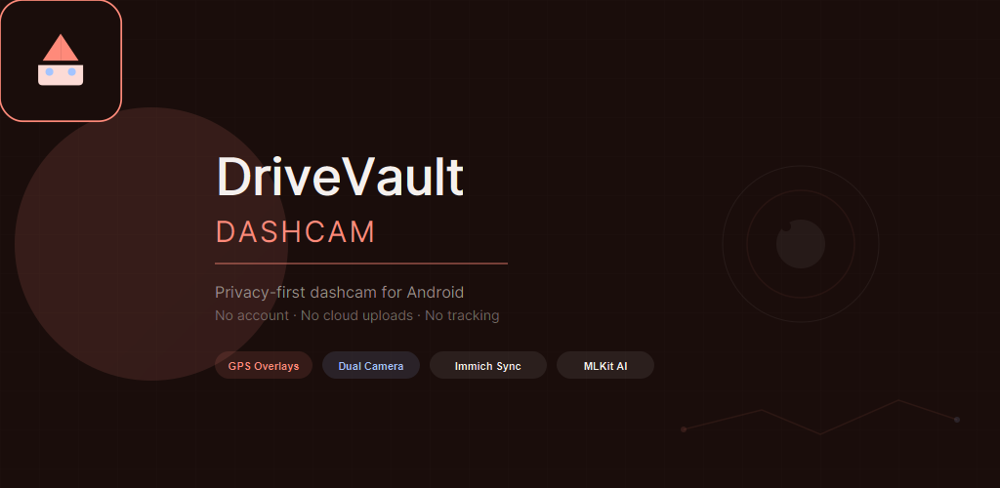
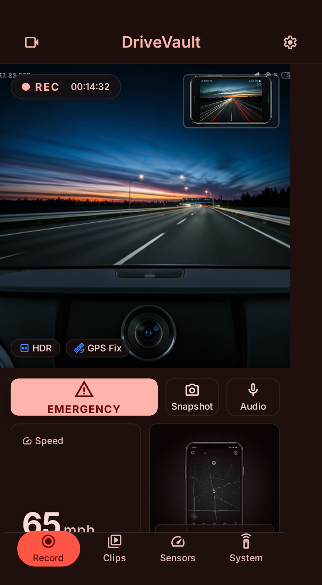
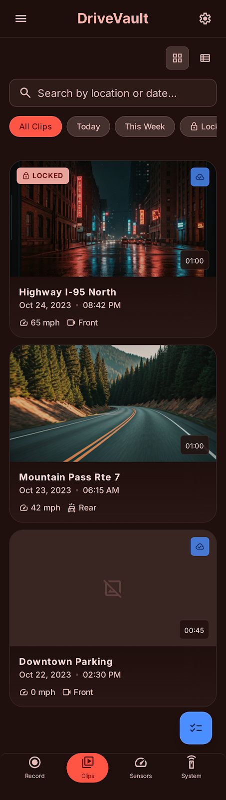
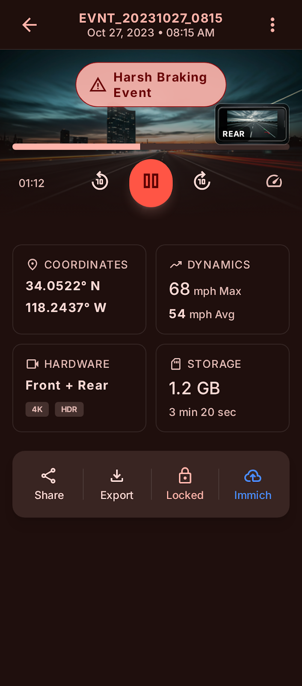
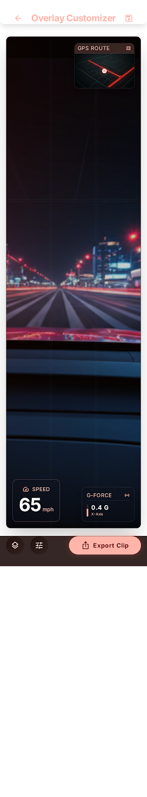

# 🛡️ DriveVault Dashcam

<p align="center">
  
</p>

<p align="center">
  <strong>A premium, privacy-first dashcam application for Android.</strong>
  <br />
  Record your drives with GPS overlays, dual-camera support, and complete control over your data.
</p>

<p align="center">
  <a href="https://github.com/chartmann1590/DriveVault/releases"></a>
  
  <a href="https://chartmann1590.github.io/DriveVault/privacy-policy.html"></a>
</p>

<div align="center">
  <h3>
    <a href="#-key-features">Features</a> • 
    <a href="#-screenshots">Screenshots</a> • 
    <a href="#-getting-started">Getting Started</a> • 
    <a href="#-privacy--transparency">Privacy</a> • 
    <a href="#-developer-guide">Developers</a>
  </h3>
</div>

---

## 🚘 Why DriveVault?

Unlike commercial dashcam apps that upload your location and drive footage to proprietary clouds, **DriveVault puts you in the driver's seat.** 

*   **Zero Accounts required.** No signup, no registration, no trackers.
*   **100% Local Storage.** Your footage stays on your device unless you actively choose to share it.
*   **Fully Offline Capability.** Map displays and speed calculations work entirely without API keys or cell signal.

---

## ✨ Key Features

### 🎥 High-Fidelity Recording
*   **Continuous Loop:** Automatically records in 60-second segments and clears the oldest unlocked clips when space is low.
*   **Multi-Camera Support:** Supports rear, front, and dual-camera preview layouts.
*   **Background Recording:** Run DriveVault as a foreground service so you can navigate or use other apps simultaneously.

### 🗺️ GPS & Telemetry Overlay
*   **Real-time HUD:** Overlays speed, compass heading, and exact coordinates.
*   **Offline Mini-Map:** Real-time OpenStreetMap (OSM) tracking panel with zero API keys required.
*   **Metadata Export:** Full telemetry logs are saved alongside each video clip.

### 📁 Advanced Clip Management
*   **Secure Lock:** One-tap lock protects clips from automatic deletion.
*   **Interactive Player:** View telemetry graphs, speeds, and routes on a map side-by-side during playback.
*   **Smart Filter:** Quickly search and filter clips by date, lock status, and sync state.

### ⚡ Smart Integrations (Optional & Opt-In)
*   **Self-Hosted Immich Sync:** Automatically back up footage to your private Immich server over Wi-Fi when charging.
*   **Secure Sharing:** Generates anonymous, 24-hour expiring sharing links via Supabase with automatic 50MB video compression.
*   **On-Device AI Detection:** Local MLKit models detect vehicles and pedestrians on-screen with zero cloud processing.
*   **In-App Bug Reporting:** Submit feedback, device diagnostics, and optional screenshots directly to the project's GitHub issues tracker.

---

## 📱 Screenshots

<table align="center">
  <tr>
    <td align="center"><strong>HUD Recording</strong></td>
    <td align="center"><strong>Clip Library</strong></td>
    <td align="center"><strong>Clip Playback</strong></td>
  </tr>
  <tr>
    <td></td>
    <td></td>
    <td></td>
  </tr>
  <tr>
    <td align="center"><strong>App Settings</strong></td>
    <td align="center"><strong>Export & Overlays</strong></td>
    <td align="center"><strong>Onboarding</strong></td>
  </tr>
  <tr>
    <td></td>
    <td></td>
    <td></td>
  </tr>
</table>

---

## 🚀 Getting Started

### For Drivers
1. **Download:** Grab the latest APK from the [Releases](https://github.com/chartmann1590/DriveVault/releases) tab.
2. **Permissions:** Grant the required permissions (Camera, Microphone, Location).
3. **Mount:** Put your phone in a standard car mount.
4. **Drive:** Hit record and rest easy knowing your drive is securely saved.

### Required Permissions Explained
*   **Camera & Mic:** Needed to capture high-definition drive videos with audio.
*   **Location / Background Location:** Displays current speed/coordinates and logs GPX tracks even if you switch apps.
*   **Notifications & Foreground Service:** Keeps the recorder active and visible in the status bar while driving.
*   **Storage (Room & Media):** Safely writes video clips and saves exports.

---

## 🔒 Privacy & Transparency

DriveVault is designed from the ground up to respect your privacy:

*   **No Commercial Trackers:** We include no advertising SDKs or monetized analytics.
*   **Opt-In Only:** Firebase analytics/crashes, Immich sync, and Supabase sharing are off by default.
*   **On-Device AI:** MLKit detection runs entirely locally on your phone's processor.

For more details, read the official [Privacy Policy](https://chartmann1590.github.io/DriveVault/privacy-policy.html).

---

## 🛠️ Developer Guide

### Prerequisites
*   Android Studio Hedgehog (2023.1.1) or newer
*   JDK 17
*   Android SDK (compileSdk 36)

### Build from Source
1. Clone the repository:
   ```bash
   git clone https://github.com/chartmann1590/DriveVault.git
   cd DriveVault
   ```
2. Set up environment properties:
   ```bash
   cp local.properties.example local.properties
   # Fill in values for Firebase, Supabase, and GitHub configurations.
   ```
3. Generate Google Services configuration:
   ```bash
   python scripts/generate_google_services_json.py
   ```
4. Build the debug application:
   ```bash
   ./gradlew assembleDebug
   ```

*Note: For security best practices and key handling, see [SECURITY.md](SECURITY.md).*
