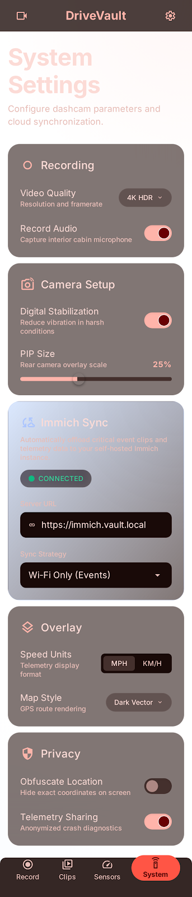
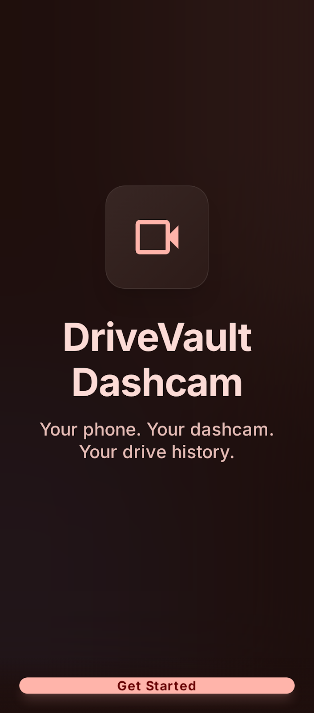

# DriveVault Dashcam

**Privacy-first dashcam for Android**

Record your drives with GPS overlays, dual-camera support, and full control over your data.

[Features](#-features) · [Screenshots](#-screenshots) · [Download](#-download) · [Setup](#-getting-started)

---

## Why DriveVault?

Most dashcam apps send your data to the cloud. DriveVault keeps everything on your device by default - no accounts, no cloud uploads, no tracking. Your drives stay private unless you choose to share them.

## Features

### Recording
- Continuous loop recording in 60-second segments
- Rear, front, and dual-camera modes
- Background recording via foreground service
- Auto-deletes oldest unlocked clips when storage is full

### GPS & Telemetry
- Real-time speed, heading, and coordinates overlay
- Compass direction display
- OSM-based mini map (no API keys needed)
- Full telemetry recording per clip

### Clip Management
- Browse, search, and filter your clip library
- Lock important clips to prevent auto-deletion
- Clip detail view with playback and metadata

### Export & Sharing
- Export raw video, metadata JSON, or GPX route files
- Share clips via Android share sheet
- Include or exclude location data in exports

### Immich Integration (Optional)
- Sync clips to your self-hosted Immich server
- Encrypted API key storage
- Configurable sync rules (Wi-Fi only, charging only, etc.)

## Screenshots

| Recording | Clip Library | Clip Detail |
|-----------|-------------|-------------|
|  |  |  |

| Settings | Export | Onboarding |
|----------|--------|------------|
|  |  |  |

## Download

> Pre-built APKs will be available in [Releases](https://github.com/chartmann1590/DriveVault/releases) once the first version is published.

### Requirements
- Android 8.0 (Oreo) or later
- Device with rear camera
- GPS recommended for full feature set

## Getting Started

### For Users
1. Download and install the APK
2. Grant camera, microphone, and location permissions
3. Mount your phone in a car dock
4. Hit record

### For Developers

#### Prerequisites
- Android Studio Hedgehog (2023.1.1) or newer
- JDK 17
- Android SDK with compileSdk 36

#### Build from Source
``bash
git clone https://github.com/chartmann1590/DriveVault.git
cd DriveVault
./gradlew assembleDebug
``

#### Firebase Configuration
Firebase values are read from `local.properties` (never committed to the repo). Copy the template and fill in your values:
``properties
FIREBASE_PROJECT_ID=your-project-id
FIREBASE_PROJECT_NUMBER=your-project-number
FIREBASE_STORAGE_BUCKET=your-project-id.firebasestorage.app
FIREBASE_DEBUG_APP_ID=your-debug-app-id
FIREBASE_DEBUG_API_KEY=your-debug-api-key
FIREBASE_RELEASE_APP_ID=your-release-app-id
FIREBASE_RELEASE_API_KEY=your-release-api-key
``

## Permissions Explained

| Permission | Why We Need It |
|---|---|
| Camera | Record video of your drives |
| Microphone | Capture audio with video clips |
| Location | GPS coordinates, speed, and map overlay |
| Notifications | Keep recording status visible |
| Storage | Save clips and exports |
| Foreground Service | Continue recording in background |
| Wake Lock | Prevent recording interruption |

## Privacy

Your data stays on your device. Here is what DriveVault does NOT do:

- Does NOT upload videos to any cloud service
- Does NOT track your location remotely
- Does NOT require an account or sign-up
- Does NOT show ads
- Does NOT sell your data

The only network features are:
- Optional Immich sync to YOUR OWN server
- Firebase crash reporting and analytics (app health only, no clip content)

## Tech Stack

Built with modern Android development tools:

- **Kotlin** + **Jetpack Compose** + **Material 3**
- **CameraX** for camera control
- **Room** for local database
- **OSMDroid** for maps
- **Media3/ExoPlayer** for video playback
- **Firebase** for crash reporting and analytics

## License

This project is provided as-is for personal use.

---

Made with care for drivers who value privacy.

